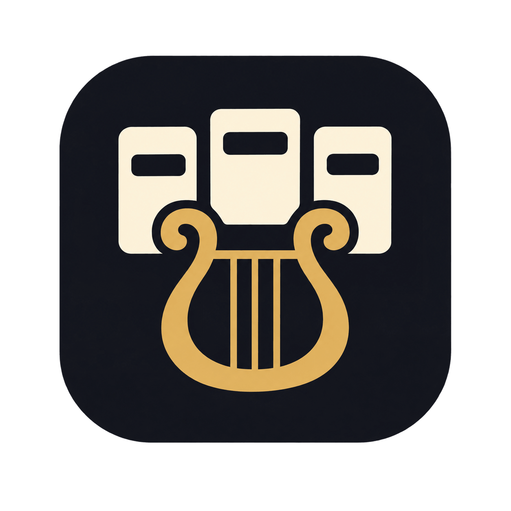

# Orchest



Shared kanban boards for teams that move together.

Built with Next.js, TypeScript, Tailwind, Zustand, TanStack Query, Supabase, and FormKit drag & drop.

## Setup

1. Create a [Supabase](https://supabase.com) project and enable Email auth.
2. In the SQL editor, run the migrations in `supabase/migrations/` **in order**:
   - [`001_init.sql`](supabase/migrations/001_init.sql) — schema, RLS, and RPCs
   - [`002_ensure_profile.sql`](supabase/migrations/002_ensure_profile.sql) — create a profile on signup
   - [`003_touch_board_updated_at.sql`](supabase/migrations/003_touch_board_updated_at.sql) — bump board `updated_at` on writes
   - [`004_boards_realtime.sql`](supabase/migrations/004_boards_realtime.sql) — add `boards` to the Realtime publication
   - [`005_transfer_ownership.sql`](supabase/migrations/005_transfer_ownership.sql) — ownership transfer RPC
   - [`006_board_background_color.sql`](supabase/migrations/006_board_background_color.sql) — board background color
   - [`007_create_board_background.sql`](supabase/migrations/007_create_board_background.sql) — pass color into `create_board`
   - [`008_card_assignees_policies.sql`](supabase/migrations/008_card_assignees_policies.sql) — assignee RLS for owners and editors
3. In **Database → Replication**, confirm Realtime is enabled for the board tables.
4. Copy env values:

```bash
cp .env.local.example .env.local
```

Fill in:

```bash
NEXT_PUBLIC_SUPABASE_URL=...
NEXT_PUBLIC_SUPABASE_PUBLISHABLE_KEY=...
```

5. Install and run:

```bash
npm install
npm run dev
```

Open [http://localhost:3000](http://localhost:3000). Unauthenticated visits go to `/login`; signed-in users land on `/boards`.

## Features

- Email/password auth (`/login`, `/signup`) and a display-name profile (`/profile`)
- Multiple boards with owner / editor / viewer roles
- Invite by email (auto-claimed on login or signup)
- Lists and cards with FormKit drag-and-drop
- Card details: description, labels, due date, assignees, comments
- Board settings: rename, background color, members, role changes, transfer ownership, leave, delete
- Live updates via Supabase Realtime, with toasts for teammate changes
- Data fetching via TanStack Query; live board UI state in Zustand
